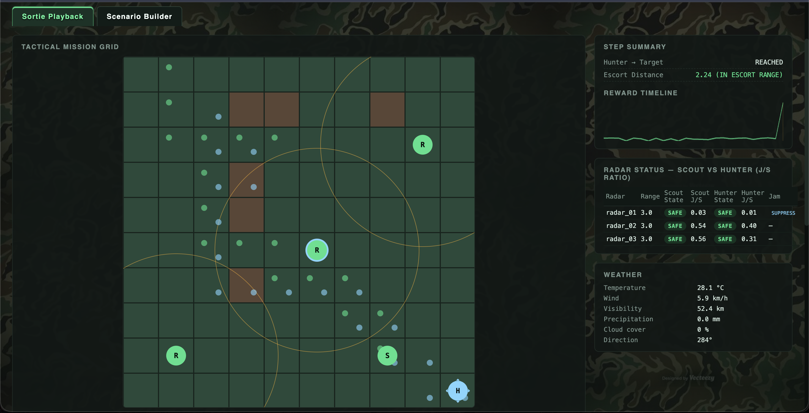
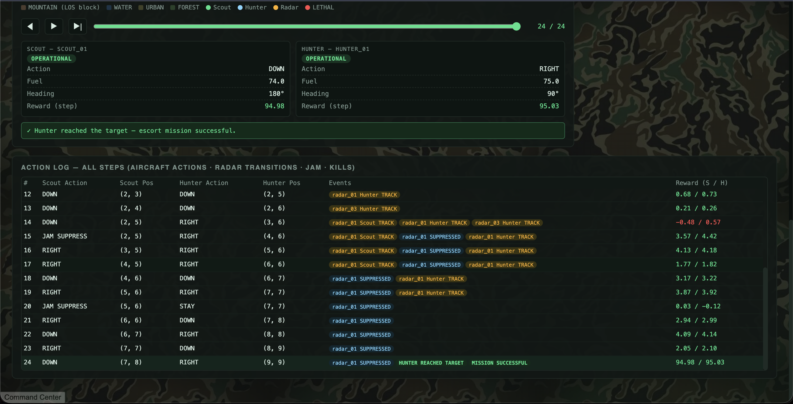
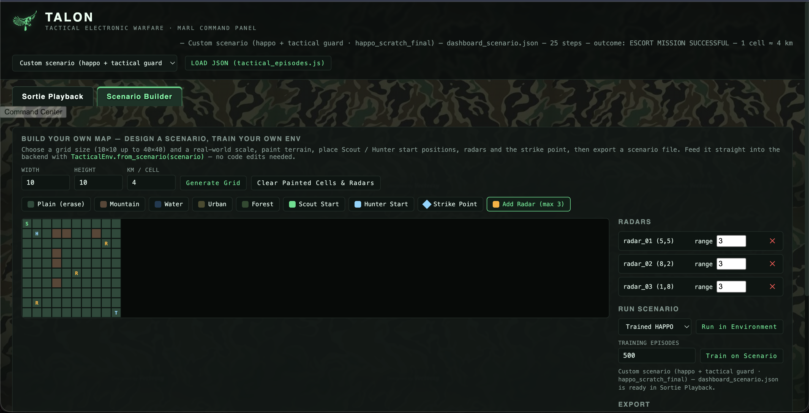

# TALON — Tactical Electronic Warfare MARL

A tactical electronic warfare (EW) simulation environment built from scratch, taken from a single-agent DQN baseline all the way to Heterogeneous-Agent PPO (HAPPO) based multi-agent reinforcement learning (MARL). The goal isn't just "can an agent reach the target" — it's whether two agents with different roles (**Scout** and **Hunter**) can coordinate to complete a tactical mission under radar threat.

## Architecture

```
                    TALON
                      │
        Tactical Electronic Warfare
                 Simulation
                      │
             ┌────────┴────────┐
             │                 │
           SCOUT             HUNTER
             │                 │
             └────────┬────────┘
                      │
                MARL / CTDE
                      │
                   HAPPO
                      │
          ┌───────────┴───────────┐
          │                       │
    Local Observations       Global State
          │                       │
          └───────────┬───────────┘
                      │
                  Environment
                      │
       ┌──────────────┼──────────────┐
       │              │              │
     Radar          Terrain        Weather
       │              │              │
       └──────────────┼──────────────┘
                      │
                  Evaluation
                      │
        ┌─────────────┴─────────────┐
        │                           │
       DQN                        HAPPO
        │                           │
        └─────────────┬─────────────┘
                      │
                  Dashboard
```

## Environment

- **Grid-world:** 10×10 tactical map
- **Scout:** Advances first, detects radar threats, applies electronic warfare via suppression/deception
- **Hunter:** Exploits the opening the Scout creates and advances on the target with escort/pursuit logic
- **Radar FSM:** `SAFE → LOCK → TRACK → LETHAL` state transitions
- **Terrain:** Mountain / Water / Forest
- **Weather:** A weather client that affects environment dynamics
- **Reward:** Grounded in the J/S ratio, shaped with escort/goal/destruction/fuel-time penalties

## Development History

The project didn't jump straight to HAPPO — it got there step by step:

1. **Environment design** — Our own tactical EW simulation (GridWorld, aircraft, radar FSM, terrain, weather) was written from scratch.
2. **Single-agent DQN** — Neural network, replay buffer, epsilon-greedy exploration, target network, checkpointing. Followed by **Double DQN** experiments (the `experiment_results_double_dqn*` folders hold different hyperparameter/target-update configurations).
3. **Probing DQN's limits** — Holdout evaluation, seed experiments, robustness and escort robustness tests were added; the question shifted from "can it reach the goal" to "does it actually generalize across conditions."
4. **Single-agent → Multi-agent** — Scout and Hunter were split into separate agents, moving to a **CTDE** (Centralized Training, Decentralized Execution) architecture: training uses global state, while execution relies only on each agent's local observations.
5. **HAPPO** — A dedicated MARL stack was built under `marl/` (`algorithms/`, `networks/`, `buffer.py`, `execution.py`), with configuration split out into `configs/marl_config.py` / `configs/environment_config.py`. Training lives in `train_happo.py`, evaluation in `evaluate_happo.py` / `evaluate_happo_holdout.py`.
6. **Dashboard** — `tacew_dashboard.html` + `dashboard_server.py` + `dashboard_episode_store.py` provide sortie playback, a scenario builder, and training curves in a single panel.

## Results

After fixing up the reward/evaluation side, a 100-episode deterministic HAPPO evaluation produced:

| Metric | Value |
|---|---|
| Average Reward | 99.49 |
| Mission Success Rate | 100% |
| Average Steps | 9 |
| Scout Reward | 58.75 |
| Hunter Reward | 101.64 |
| Radar Detection/Failure | 0% |
| Min / Max Reward | 95.15 / 100+ |

## Dashboard

The `tacew_dashboard.html` command panel ties training, evaluation, and mission replay together in one place.

**Sortie Playback** — replay a mission step by step on the tactical grid, with live radar range circles, J/S ratio per radar, weather, and a reward timeline:



**Action Log** — a full per-step breakdown of both agents' actions, positions, radar transitions, jamming events, and rewards for the selected sortie:



**Scenario Builder** — paint your own terrain, place Scout/Hunter start positions and radars, then train or run a policy on the custom map without touching any code:



## Project Structure

```
environment/     # Grid-world, tactical env, observation space, aircraft/radar entities
marl/            # HAPPO algorithm, actor/critic networks, execution, buffer
agent/           # DQN agent and replay buffer
aircraft/        # Aircraft model and dynamics
radar/           # Radar FSM and models
terrain/         # Terrain/map data
weather/         # Weather client and models
configs/         # MARL and environment configurations
models/          # Deployment-ready checkpoints (.pth)
test/            # Unit tests
experiment_results*/  # Training history and seed comparisons (CSV + plots)
assets/          # Dashboard screenshots used in this README
```

## Setup

```bash
python3 -m venv .venv
source .venv/bin/activate
pip install -r requirements.txt
```

Requirements: `torch>=2.0`, `numpy>=1.26`, `requests>=2.31`, `matplotlib>=3.8`

## Usage

**Training**

```bash
python3 train_tactical_dqn.py
python3 train_happo.py --mode scratch
```

**Evaluation**

```bash
python3 evaluate_happo.py
python3 evaluate_happo_holdout.py
python3 evaluate_tactical_holdout.py
python3 evaluate_escort_robustness.py
```

**Experiment comparison and plotting**

```bash
python3 run_seed_experiments.py
python3 compare_experiments.py
python3 plot_experiment_results.py
```

**Dashboard**

```bash
python3 dashboard_server.py
```

then open `tacew_dashboard.html` in your browser — you can trigger training/evaluation commands from the panel, and replay each sortie's agent positions, observations, policy used, radar state, and mission outcome on the map.

**Running a custom scenario**

A `scenario.json` downloaded from the dashboard's Scenario Builder tab is a map definition — it has no per-step positions or rewards, so it can't be played directly via "LOAD JSON". Run this first:

```bash
python3 run_scenario.py path/to/scenario.json
```

This runs the scenario through the environment, converts it into a playable sortie record, and adds it to the dashboard's episode list.

## Testing

```bash
python3 -m pytest test/
```

## Future Work

- Fill in the GitHub repo's About section (description, website, topics)
- Generalization tests across a wider set of radar/terrain layouts beyond the current holdout set
- Comparison against other MARL algorithms beyond HAPPO (e.g. MAPPO, IPPO baselines already scaffolded in the roadmap)
- Scale beyond a single Scout/Hunter pair to larger multi-aircraft formations
- Export trained policies (e.g. ONNX) for deployment outside the training stack
- Short demo video/GIF of a full sortie playback for the README

## License

Copyright (c) 2026 Gökhan GÜLER and Uğur TURHAN

Permission is hereby granted, free of charge, to any person obtaining a copy
of this software and associated documentation files (the "Software"), to deal
in the Software without restriction, including without limitation the rights
to use, copy, modify, merge, publish, distribute, sublicense, and/or sell
copies of the Software, and to permit persons to whom the Software is
furnished to do so, subject to the following conditions:

The above copyright notice and this permission notice shall be included in
all copies or substantial portions of the Software.

THE SOFTWARE IS PROVIDED "AS IS", WITHOUT WARRANTY OF ANY KIND, EXPRESS OR
IMPLIED, INCLUDING BUT NOT LIMITED TO THE WARRANTIES OF MERCHANTABILITY,
FITNESS FOR A PARTICULAR PURPOSE AND NONINFRINGEMENT. IN NO EVENT SHALL THE
AUTHORS OR COPYRIGHT HOLDERS BE LIABLE FOR ANY CLAIM, DAMAGES OR OTHER
LIABILITY, WHETHER IN AN ACTION OF CONTRACT, TORT OR OTHERWISE, ARISING FROM,
OUT OF OR IN CONNECTION WITH THE SOFTWARE OR THE USE OR OTHER DEALINGS IN
THE SOFTWARE.
